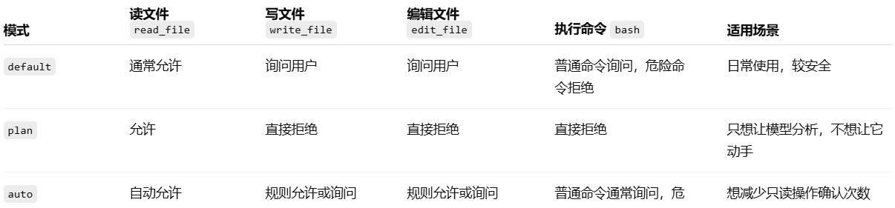

# 权限系统

***模型可以提出行动建议，但真正执行之前，必须先过安全关。***

```python
LLM 产生工具调用意图
        ↓
权限系统检查
        ↓
deny rules 拒绝规则
        ↓
mode check 模式检查
        ↓
allow rules 允许规则
        ↓
ask user 请求用户确认
        ↓
真正执行工具
```

## bash命令安全检查

```python
@dataclass(frozen=True)
class SecurityFailure:
    """A matched Windows command safety rule."""
    name: str
    pattern: str
    reason: str

#windows的命令安全检查器
class WindowsCommandSecurityValidator:
    """
    Validate Windows shell commands for high-risk operations.

    The checks are intentionally conservative and focus on commands that can
    delete data, modify system state, elevate privileges, or execute hidden
    downloaded/encoded PowerShell payloads.
    """

    VALIDATORS: Tuple[Tuple[str, str, str], ...] = (
        (   #删除类命令
            "cmd_recursive_delete",
            r"\b(?:del|erase)\b(?=[^\r\n]*\s/[a-z]*[sqf][a-z]*)",
            "cmd delete with quiet, recursive, or force switches",
        ),
        (   
            "cmd_remove_directory_tree",
            r"\b(?:rd|rmdir)\b(?=[^\r\n]*\s/[a-z]*s[a-z]*)",
            "recursive directory removal",
        ),
        (
            "powershell_remove_item_recursive",
            r"\b(?:remove-item|rm|ri|del|erase|rd|rmdir)\b"
            r"(?=[^\r\n]*\s-(?:recurse|r)\b)",
            "PowerShell recursive removal",
        ),
        (
            "powershell_remove_item_force",
            r"\b(?:remove-item|rm|ri|del|erase|rd|rmdir)\b"
            r"(?=[^\r\n]*\s-(?:force|f)\b)",
            "PowerShell forced removal",
        ),
        (
            "unix_style_recursive_delete",
            r"\brm\b(?=[^\r\n]*\s-[a-z]*r[a-z]*)",
            "Unix-style recursive removal available in some Windows shells",
        ),
        (
            "format_or_partition",
            r"\b(?:format|diskpart|mountvol|cleanmgr|defrag|chkdsk)\b",
            "disk formatting, partitioning, or destructive maintenance",
        ),
        (
            "boot_or_system_config",
            r"\b(?:bcdedit|bootrec|reagentc|manage-bde|cipher)\b",
            "boot, recovery, encryption, or destructive disk configuration",
        ),
        (
            "registry_destructive_change",
            r"\breg(?:\.exe)?\s+(?:delete|add|import|restore|load|unload)\b",
            "registry modification",
        ),
        (
            "service_or_process_kill",
            r"\b(?:taskkill|stop-process|kill|sc(?:\.exe)?\s+(?:delete|stop|config))\b",
            "process or service termination/configuration",
        ),
        (
            "shutdown_or_restart",
            r"\b(?:shutdown|restart-computer|stop-computer|logoff)\b",
            "shutdown, restart, or logoff",
        ),
        (
            "privilege_elevation",
            r"\b(?:runas|start-process)\b(?=[^\r\n]*(?:/user:|-verb\s+runas))",
            "privilege elevation",
        ),
        (
            "powershell_encoded_or_hidden",
            r"\bpowershell(?:\.exe)?\b"
            r"(?=[^\r\n]*(?:-(?:enc|encodedcommand|e)\b|-windowstyle\s+hidden|-nop\b))",
            "encoded, hidden, or no-profile PowerShell execution",
        ),
        (
            "powershell_invoke_expression",
            r"\b(?:iex|invoke-expression)\b",
            "dynamic PowerShell expression execution",
        ),
        (
            "download_and_execute",
            r"\b(?:iwr|irm|invoke-webrequest|invoke-restmethod|curl|wget)\b"
            r"(?=[^\r\n]*(?:\||;|&&|\biex\b|invoke-expression))",
            "download piped or chained into execution",
        ),
        (
            "script_policy_bypass",
            r"\b(?:set-executionpolicy|powershell(?:\.exe)?)\b"
            r"(?=[^\r\n]*(?:bypass|unrestricted))",
            "PowerShell execution policy bypass",
        ),
        (
            "ownership_or_acl_change",
            r"\b(?:takeown|icacls|cacls|attrib)\b",
            "ownership, ACL, or file attribute changes",
        ),
    )

    def __init__(self, validators: Optional[Iterable[Tuple[str, str, str]]] = None):
        self.validators = tuple(validators or self.VALIDATORS)

    #返回命中的规则列表
    def validate(self, command: str) -> List[Tuple[str, str]]:
        """
        Check a command against all validators.

        Returns a list of (validator_name, matched_pattern) tuples. An empty
        list means no high-risk pattern was found.
        """
        return [
            (name, pattern)
            for name, pattern, _reason in self.validators
            if re.search(pattern, command, flags=re.IGNORECASE)
        ]

    #返回更详细的 SecurityFailure 对象，包含规则名、正则、原因。
    def validate_verbose(self, command: str) -> List[SecurityFailure]:
        """Return matched rules with human-readable reasons."""
        return [
            SecurityFailure(name=name, pattern=pattern, reason=reason)
            for name, pattern, reason in self.validators
            if re.search(pattern, command, flags=re.IGNORECASE)
        ]

    #如果没有任何规则命中，返回 True；否则返回 False。
    def is_safe(self, command: str) -> bool:
        """Return True only if no validator triggers."""
        return len(self.validate(command)) == 0

    #返回人类可读的解释，
    def describe_failures(self, command: str) -> str:
        """Human-readable summary of validation failures."""
        failures = self.validate_verbose(command)
        if not failures:
            return "No issues detected"
        reasons = [f"{failure.name}: {failure.reason}" for failure in failures]
        
        return "Security flags: " + "; ".join(reasons)
```

## 权限配置文件

```yaml
modes:
  - default
  - plan
  - auto

read_only_tools:
  - read_file

write_tools:
  - write_file
  - edit_file
  # - bash

default_rules:
  # Always deny dangerous Windows command patterns
  # Linux: rm -rf / -> Windows recursive/forced delete commands
  - tool: bash
    content: "del /s *"
    behavior: deny

  - tool: bash
    content: "del /f *"
    behavior: deny

  - tool: bash
    content: "erase /s *"
    behavior: deny

  - tool: bash
    content: "erase /f *"
    behavior: deny

  - tool: bash
    content: "rd /s *"
    behavior: deny

  - tool: bash
    content: "rmdir /s *"
    behavior: deny

  - tool: bash
    content: "Remove-Item * -Recurse"
    behavior: deny

  - tool: bash
    content: "Remove-Item * -Force"
    behavior: deny

  - tool: bash
    content: "rm -r *"
    behavior: deny

  - tool: bash
    content: "rm -rf *"
    behavior: deny

  # Linux: sudo * -> Windows privilege elevation commands
  - tool: bash
    content: "runas /user:*"
    behavior: deny

  - tool: bash
    content: "Start-Process * -Verb RunAs"
    behavior: deny

  # Allow reading anything
  - tool: read_file
    path: "*"
    behavior: allow
```

## 开启权限检查

```python
class PermissionManager:
    """
    Manages permission decisions for tool calls.
    Pipeline: deny_rules -> mode_check -> allow_rules -> ask_user
    The teaching version keeps the decision path short on purpose so readers
    can implement it themselves before adding more advanced policy layers.
    """
    def __init__(self, mode: str = "default", rules: list = None):
        #判断权限是否在配置里
        if mode not in MODES:
            raise ValueError(f"Unknown mode: {mode}. Choose from {MODES}")
        self.mode = mode
        #是否传入权限规则，不传入就使用默认规则
        self.rules = rules or list(DEFAULT_RULES)
        #记录当前已经连续拒绝了多少次工具调用
        self.consecutive_denials = 0
        # 设置最大连续拒绝次数阈值
        self.max_consecutive_denials = 3
```

### bash命令判断

```python
# Step 0: 巴士命令判断
  if tool_name == "bash":
      logger.info("执行 Bash 工具调用，进行安全检查")
      command = tool_input.get("command", "")
      failures = bash_validator.validate(command)
      if failures:
          severe = {
              "cmd_delete",
              "cmd_recursive_delete",
              "cmd_remove_directory",
              "cmd_remove_directory_tree",
              "powershell_remove_item",
              "powershell_remove_item_recursive",
              "powershell_remove_item_force",
              "unix_style_delete",
              "unix_style_recursive_delete",
          }

          severe_hits = [f for f in failures if f[0] in severe]
          if severe_hits:
              logger.info("发现严重安全问题，直接拒绝")
              desc = bash_validator.describe_failures(command)
              return {"behavior": "deny",
                      "reason": f"Bash validator: {desc}"}
          #一般情况下的安全问题，需要用户确认
          logger.info("发现一般安全问题，需要用户确认")
          desc = bash_validator.describe_failures(command)
          return {"behavior": "ask","reason": f"Bash validator flagged: {desc}"}
```

### deny rules 拒绝规则

```yaml
# Step 1: 如果命令匹配到 deny 规则，直接拒绝
logger.info("deny rules 拒绝规则检查")
for rule in self.rules:
    if rule["behavior"] != "deny":
        logger.debug(f"Rule {rule} 不是 deny rule, 通过.")
        continue
    if self._matches(rule, tool_name, tool_input):
        logger.info(f"Tool {tool_name} 被拒绝规则组织: {rule}")
        return {"behavior": "deny","reason": f"Blocked by deny rule: {rule}"}
logger.info("通过 deny rule 检查，继续下一步：模式检查")
```

### 模式检查

```python
# Step 2: 模式检查
logger.info(f"mode: {self.mode} 进行模式检查")
if self.mode == "plan":
    # Plan mode: 拒绝所有写操作，允许读取
    if tool_name in WRITE_TOOLS:
        logger.info(f"mode: {self.mode} 只能读文件")
        return {"behavior": "deny","reason": "Plan mode: write operations are blocked"}
    logger.info(f"mode: {self.mode} 执行通过")
    return {"behavior": "allow", "reason": "Plan mode: read-only allowed"}
if self.mode == "auto":
    # Auto mode: 自动允许只读工具，对写操作进行询问
    if tool_name in READ_ONLY_TOOLS or tool_name == "read_file":
        logger.info(f"mode: {self.mode} 自动读取文件")
        return {"behavior": "allow","reason": "Auto mode: read-only tool auto-approved"}
    pass
```

### allow rules 允许规则

```python
# Step 3: 允许规则
logger.info("allow rules 允许规则检查")
for rule in self.rules:
    if rule["behavior"] != "allow":
        logger.debug(f"Rule {rule} 不是 allow rule, 继续执行.")
        continue
    if self._matches(rule, tool_name, tool_input):
        logger.info(f"Rule {rule} 匹配到允许规则，就直接执行")
        self.consecutive_denials = 0
        return {"behavior": "allow","reason": f"Matched allow rule: {rule}"}
```

### 询问用户

```yaml
# Step 4: 询问用户
logger.info(f"没有找到匹配的规则 {tool_name}, ask user 请求用户确认")
return {"behavior": "ask","reason": f"No rule matched for {tool_name}, asking user"}
```

## 匹配函数

```python
"""
判断一条规则是否匹配当前工具调用
输入：
    rule：规则字典
    tool_name：工具名称
    tool_input：工具输入
输出：
    bool：是否匹配
"""
def _matches(self, rule: dict, tool_name: str, tool_input: dict) -> bool:
    # 如果工具不在规则内，返回False
    if rule.get("tool") and rule["tool"] != "*":
        if rule["tool"] != tool_name:
            return False
    # 如果有路径就判断路径是否匹配
    if "path" in rule and rule["path"] != "*":
        path = tool_input.get("path", "")
        if not fnmatch(path, rule["path"]):
            return False
    # 判断命令是否匹配
    if "content" in rule:
        command = tool_input.get("command", "")
        if not fnmatch(command, rule["content"]):
            return False
    return True
```

### 询问用户函数

```python
def ask_user(self, tool_name: str, tool_input: dict) -> bool:
	  """Interactive approval prompt. Returns True if approved."""
	  preview = json.dumps(tool_input, ensure_ascii=False)[:200]
	  print(f"\n  [Permission] {tool_name}: {preview}")
	  try:
	      answer = input("  Allow? (y/n/always): ").strip().lower()
	  except (EOFError, KeyboardInterrupt):
	      return False
	  if answer == "always":
	      # Add permanent allow rule for this tool
	      self.rules.append({"tool": tool_name, "path": "*", "behavior": "allow"})
	      self.consecutive_denials = 0
	      return True
	  if answer in ("y", "yes"):
	      self.consecutive_denials = 0
	      return True
	  # Track denials for circuit breaker
	  self.consecutive_denials += 1
	  if self.consecutive_denials >= self.max_consecutive_denials:
	      print(f"  [{self.consecutive_denials} consecutive denials -- "
	            "consider switching to plan mode]")
	  return False
```

### 代码合并

```python
from fnmatch import fnmatch
import json

from utils.bash_check import bash_validator
from utils.config_handler import permission_config
from utils.logger_handler import logger

MODES = permission_config["modes"]
READ_ONLY_TOOLS = set(permission_config["read_only_tools"])
WRITE_TOOLS = set(permission_config["write_tools"])

DEFAULT_RULES = permission_config["default_rules"]

class PermissionManager:
    """
    Manages permission decisions for tool calls.
    Pipeline: deny_rules -> mode_check -> allow_rules -> ask_user
    The teaching version keeps the decision path short on purpose so readers
    can implement it themselves before adding more advanced policy layers.
    """
    def __init__(self, mode: str = "default", rules: list = None):
        #判断权限是否在配置里
        if mode not in MODES:
            raise ValueError(f"Unknown mode: {mode}. Choose from {MODES}")
        self.mode = mode
        #是否传入权限规则，不传入就使用默认规则
        self.rules = rules or list(DEFAULT_RULES)
        #记录当前已经连续拒绝了多少次工具调用
        self.consecutive_denials = 0
        # 设置最大连续拒绝次数阈值
        self.max_consecutive_denials = 3

    """
    输入：
        tool_name：工具名称
        tool_input：工具输入
    输出：
        {"behavior": "allow"|"deny"|"ask", "reason": str}
    """    
    def check(self, tool_name: str, tool_input: dict) -> dict:
        # Step 0: 权限系统检查
        if tool_name == "bash":
            logger.info("执行 Bash 工具调用，进行安全检查")
            command = tool_input.get("command", "")
            failures = bash_validator.validate(command)
            if failures:
                severe = {
                    "cmd_delete",
                    "cmd_recursive_delete",
                    "cmd_remove_directory",
                    "cmd_remove_directory_tree",
                    "powershell_remove_item",
                    "powershell_remove_item_recursive",
                    "powershell_remove_item_force",
                    "unix_style_delete",
                    "unix_style_recursive_delete",
                }

                severe_hits = [f for f in failures if f[0] in severe]
                if severe_hits:
                    logger.info("发现严重安全问题，直接拒绝")
                    desc = bash_validator.describe_failures(command)
                    return {"behavior": "deny",
                            "reason": f"Bash validator: {desc}"}
                #一般情况下的安全问题，需要用户确认
                logger.info("发现一般安全问题，需要用户确认")
                desc = bash_validator.describe_failures(command)
                return {"behavior": "ask","reason": f"Bash validator flagged: {desc}"}
        # Step 1: 如果命令匹配到 deny 规则，直接拒绝
        logger.info("deny rules 拒绝规则检查")
        for rule in self.rules:
            if rule["behavior"] != "deny":
                logger.debug(f"Rule {rule} 不是 deny rule, 通过.")
                continue
            if self._matches(rule, tool_name, tool_input):
                logger.info(f"Tool {tool_name} 被拒绝规则组织: {rule}")
                return {"behavior": "deny","reason": f"Blocked by deny rule: {rule}"}
        logger.info("通过 deny rule 检查，继续下一步：模式检查")
        # Step 2: 模式检查
        logger.info(f"mode: {self.mode} 进行模式检查")
        if self.mode == "plan":
            # Plan mode: 拒绝所有写操作，允许读取
            if tool_name in WRITE_TOOLS:
                logger.info(f"mode: {self.mode} 只能读文件")
                return {"behavior": "deny","reason": "Plan mode: write operations are blocked"}
            logger.info(f"mode: {self.mode} 执行通过")
            return {"behavior": "allow", "reason": "Plan mode: read-only allowed"}
        if self.mode == "auto":
            # Auto mode: 自动允许只读工具，对写操作进行询问
            if tool_name in READ_ONLY_TOOLS or tool_name == "read_file":
                logger.info(f"mode: {self.mode} 自动读取文件")
                return {"behavior": "allow","reason": "Auto mode: read-only tool auto-approved"}
            pass
        # Step 3: 允许规则
        logger.info("allow rules 允许规则检查")
        for rule in self.rules:
            if rule["behavior"] != "allow":
                logger.debug(f"Rule {rule} 不是 allow rule, 继续执行.")
                continue
            if self._matches(rule, tool_name, tool_input):
                logger.info(f"Rule {rule} 匹配到允许规则，就直接执行")
                self.consecutive_denials = 0
                return {"behavior": "allow","reason": f"Matched allow rule: {rule}"}
        # Step 4: 询问用户
        logger.info(f"没有找到匹配的规则 {tool_name}, ask user 请求用户确认")
        return {"behavior": "ask","reason": f"No rule matched for {tool_name}, asking user"}
    
    
    """
    判断一条规则是否匹配当前工具调用
    输入：
        rule：规则字典
        tool_name：工具名称
        tool_input：工具输入
    输出：
        bool：是否匹配
    """
    def _matches(self, rule: dict, tool_name: str, tool_input: dict) -> bool:
        # 如果工具不在规则内，返回False
        if rule.get("tool") and rule["tool"] != "*":
            if rule["tool"] != tool_name:
                return False
        # 如果有路径就判断路径是否匹配
        if "path" in rule and rule["path"] != "*":
            path = tool_input.get("path", "")
            if not fnmatch(path, rule["path"]):
                return False
        # 判断命令是否匹配
        if "content" in rule:
            command = tool_input.get("command", "")
            if not fnmatch(command, rule["content"]):
                return False
        return True
    
    def ask_user(self, tool_name: str, tool_input: dict) -> bool:
        """Interactive approval prompt. Returns True if approved."""
        preview = json.dumps(tool_input, ensure_ascii=False)[:200]
        print(f"\n  [Permission] {tool_name}: {preview}")
        try:
            answer = input("  Allow? (y/n/always): ").strip().lower()
        except (EOFError, KeyboardInterrupt):
            return False
        if answer == "always":
            # Add permanent allow rule for this tool
            self.rules.append({"tool": tool_name, "path": "*", "behavior": "allow"})
            self.consecutive_denials = 0
            return True
        if answer in ("y", "yes"):
            self.consecutive_denials = 0
            return True
        # Track denials for circuit breaker
        self.consecutive_denials += 1
        if self.consecutive_denials >= self.max_consecutive_denials:
            print(f"  [{self.consecutive_denials} consecutive denials -- "
                  "consider switching to plan mode]")
        return False
```

## 模型调用

```python
import os
import json
try:
    import readline
    # #143 UTF-8 backspace fix for macOS libedit
    readline.parse_and_bind('set bind-tty-special-chars off')
    readline.parse_and_bind('set input-meta on')
    readline.parse_and_bind('set output-meta on')
    readline.parse_and_bind('set convert-meta off')
    readline.parse_and_bind('set enable-meta-keybindings on')
except ImportError:
    pass
from openai import OpenAI
from dotenv import load_dotenv
from utils.logger_handler import logger
from utils.config_handler import compact_config
from state.agent_state import CompactState

#导入提示词
from system_prompt import SYSTEM_TEST,SYSTEM_COMPACT,SYSTEM_PERMISSION 
#导入工具配置
from tools_configs import TOOLS,TASK
#导入agent state
from state.agent_state import LoopState
#导入utils里的相关函数
from utils.path_sandbox import safe_path
from utils.normalize_messages import normalize_messages
from utils.message_log import save_message_log
from utils.permission_check import PermissionManager
#导入工具函数映射表
from tools_handlers import TOOL_HANDLERS
from tools.compact_tools import micro_compact,estimate_context_size,compact_history

#导入模型的url和token
load_dotenv(override=True)
client = OpenAI(
    base_url=os.getenv("ANTHROPIC_BASE_URL"),
    api_key=os.getenv("ANTHROPIC_AUTH_TOKEN"),
)
MODEL = os.environ["MODEL_ID"]

#系统提示词
SYSTEM =SYSTEM_PERMISSION 
#工具配置
TOOLS = TOOLS+TASK
#工具名映射到处理函数
TOOL_HANDLERS = TOOL_HANDLERS 

def agent_loop(state: LoopState,compact: CompactState,perms: PermissionManager):
    while True:
        
        #判断工具使用是否超过阈值，如果超过就压缩
        logger.info("开始判断工具是否要压缩")
        state.messages[:] = micro_compact(state.messages)

        if estimate_context_size(state.messages) > compact_config["CONTEXT_LIMIT"]:
            
            state.messages[:] = compact_history(state.messages, compact)

        #使用消息规范化函数将消息列表转换为模型输入格式，并调用模型生成回复
        response = client.chat.completions.create(
            model=MODEL,
            messages=normalize_messages([
                {"role": "system", "content": SYSTEM},
                *state.messages,
            ]),
            tools=TOOLS,
            tool_choice="auto",
            max_tokens=8000,
        )

        #获取模型恢复的content，并追加到消息列表中
        assistant_message = response.choices[0].message
        assistant_record = {
            "role": "assistant",
            "content": assistant_message.content,
        }
        #判断是否调用工具，如果调用了工具就执行工具函数，并将结果追加到消息列表中
        if assistant_message.tool_calls:
            assistant_record["tool_calls"] = [
                #model_dump() 把 OpenAI SDK 返回的对象转换成普通 Python 字典
                tool_call.model_dump() for tool_call in assistant_message.tool_calls 
            ]

        save_message_log(
            message=assistant_record,
            token=response.usage,
        )

        state.messages.append(assistant_record)
        
        #如果没有调用工具就结束循环
        if not assistant_message.tool_calls:
            return
         
        for tool_call in assistant_message.tool_calls:
            function = tool_call.function
            tool_name = function.name

            #进行权限检查
            tool_args = json.loads(function.arguments or "{}")
            decision = perms.check(tool_name, tool_args)
            if decision["behavior"] == "deny":
                logger.info(f"工具调用被拒绝: {tool_name}")
                output = f"Permission denied: {decision['reason']}"

            elif decision["behavior"] == "ask":
                logger.info(f"需要用户确认: {tool_name}")
                if perms.ask_user(tool_name, tool_args):
                    logger.info(f"用户确认了工具调用: {tool_name}")
                    handler = TOOL_HANDLERS.get(tool_name)
                    if tool_name == "compact":
                        output = handler(**tool_args,state=compact,messages=state.messages) if handler else f"Unknown tool: {tool_name}"
                    elif tool_name == "read_file":
                        output = handler(**tool_args,state=compact,tool_call_id=tool_call.id) if handler else f"Unknown tool: {tool_name}"
                    else:
                        output = handler(**tool_args,tool_call_id=tool_call.id) if handler else f"Unknown tool: {tool_name}"
                else:
                     logger.info(f"用户拒绝了工具调用: {tool_name}")
                     output = f"Permission denied by user for {tool_name}"

            else:# allow
                logger.info(f"工具未被拒绝，也不需要询问用户，直接调用: {tool_name}")
                handler = TOOL_HANDLERS.get(tool_name)
                if tool_name == "compact":
                    output = handler(**tool_args,state=compact,messages=state.messages) if handler else f"Unknown tool: {tool_name}"
                elif tool_name == "read_file":
                    output = handler(**tool_args,state=compact,tool_call_id=tool_call.id) if handler else f"Unknown tool: {tool_name}"
                else:
                    output = handler(**tool_args,tool_call_id=tool_call.id) if handler else f"Unknown tool: {tool_name}"

            tool_record = {
                "role": "tool",
                "tool_call_id": tool_call.id,
                "content": output,
            }

            state.messages.append(tool_record)

            save_message_log(
                message=tool_record,
                token=None,
            )
        

if __name__ == "__main__":
    
    history = []
    recent_files = []
    #query="我想要知道当前目录下的文件，并到找到一个read_file.txt文件，请总结50字的内容给我。"
    query="请帮我删除test文件夹"
    history.append({"role": "user", "content": query})
    state = LoopState(messages=history)
    compact=CompactState(recent_files=recent_files)
    perms = PermissionManager(mode="default")
    agent_loop(state, compact, perms)

    for messages in history:
        print("--" * 10)
        print(f"消息角色：{messages['role']}: {messages['content']}")
        print("--" * 10)

        
```

